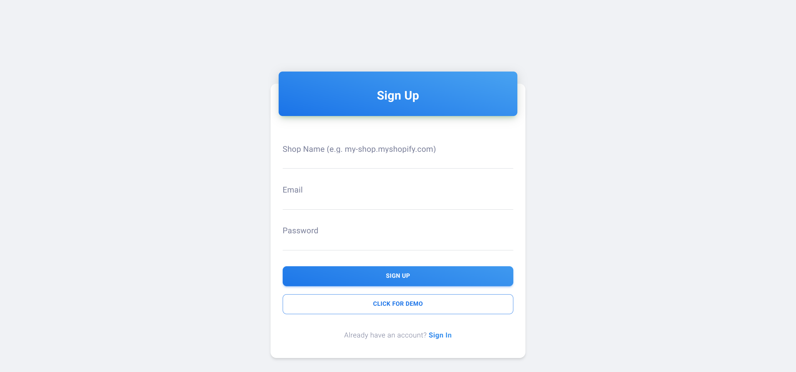
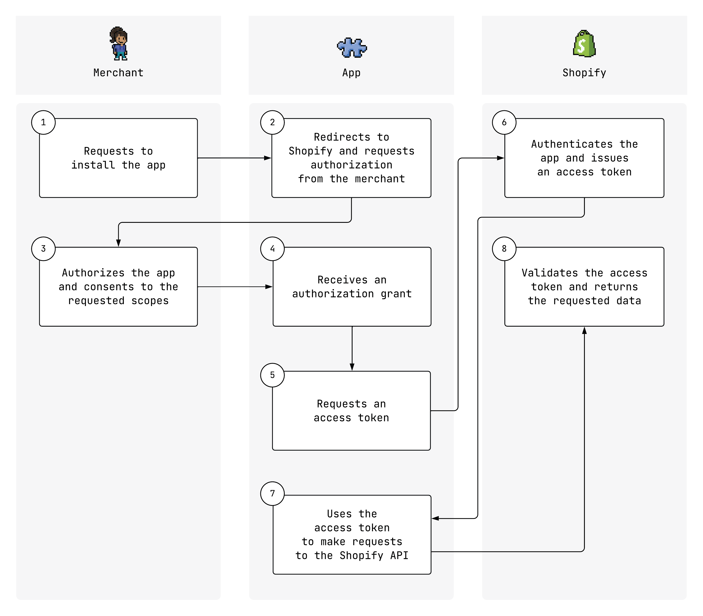
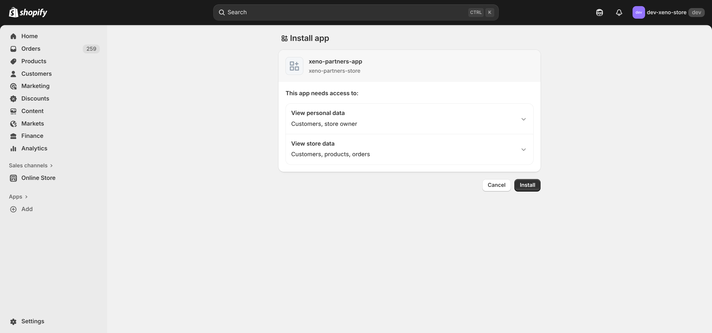
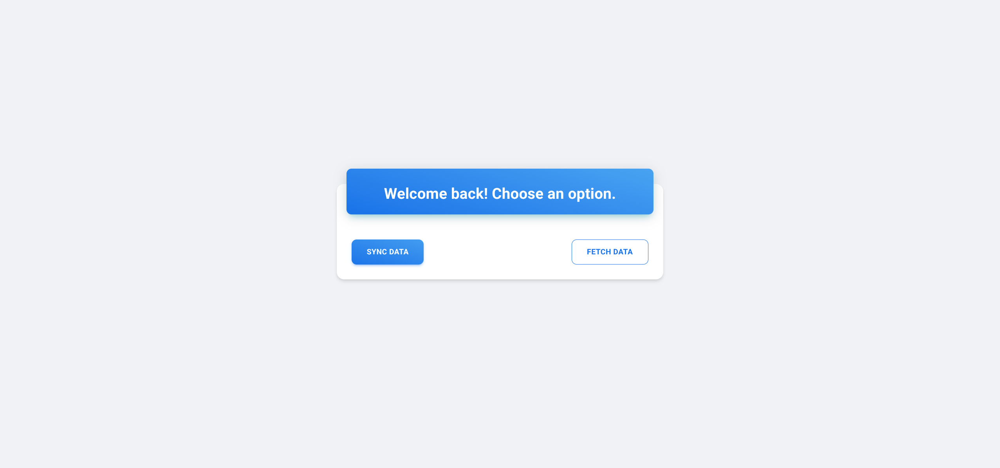
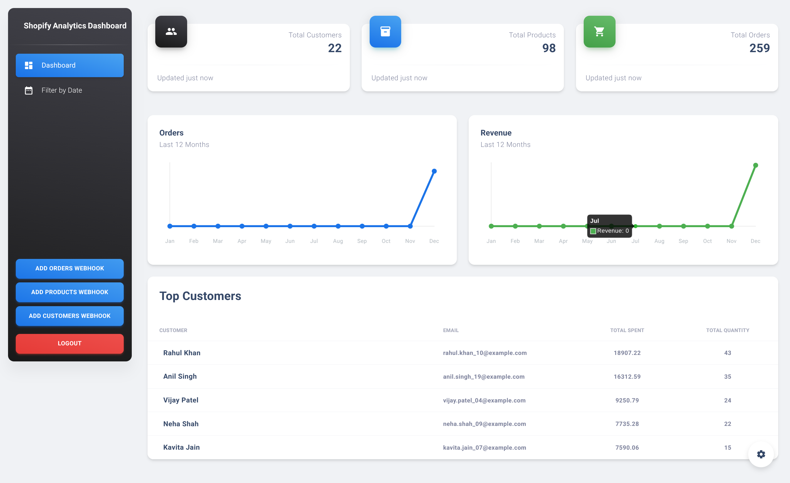
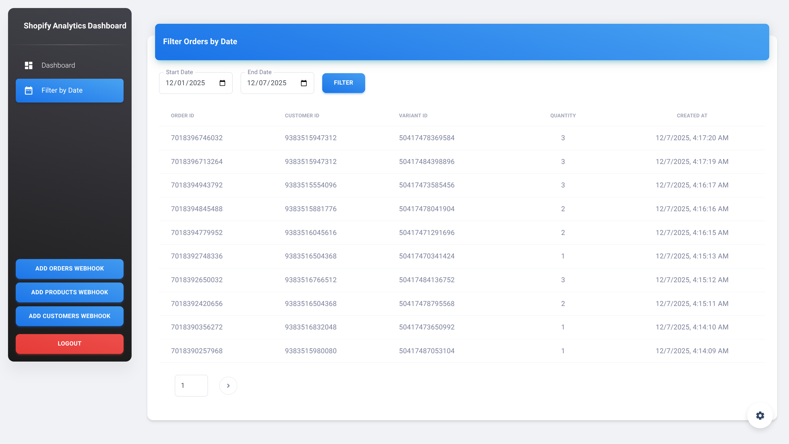
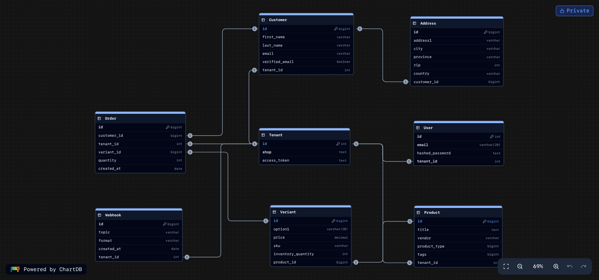

# Multi-Tenant Shopify Data Ingestion & Insights Service

##  Project Overview
This service connects to a Shopify store, ingests data (Customers, Products, Orders) via the Shopify Admin API, stores it in a relational database (PostgreSQL) with multi-tenant isolation, and visualizes key business metrics on an interactive dashboard.

## Features
- **Shopify Integration**: Secure OAuth 2.0 flow to connect and authorize Shopify stores.
- **Data Ingestion**: Robust syncing of Customers, Products, and Orders from Shopify to a local PostgreSQL database.
- **Multi-Tenancy**: Architecture supports multiple users/shops, ensuring data isolation for each tenant.
- **Insights Dashboard**:
  - **Key Metrics**: Total Sales, Total Orders, Total Customers, and Average Order Value.
  - **Interactive Graphs**: "Sales over Time" and "Orders over Time" charts powered by Chart.js.
  - **Top Customers**: A list of highest-spending customers.
- **Advanced Filtering**: Dedicated "Filter by Date" page to analyze metrics for specific time ranges.
- **Authentication**: Secure Email/Password login system using JWT (JSON Web Tokens).
- **Data Management**: A suite of Python scripts to generate realistic dummy data and clean up the Shopify environment for testing.
- **Real-time Updates**:
  - **Webhooks**: Automatically listens for data changes (Create/Delete) in Shopify for Orders, Products, and Customers.
  - **Server-Sent Events (SSE)**: Pushes real-time updates to the frontend dashboard instantly when new data is received via webhooks, ensuring the UI is always in sync without manual refreshes.

## Tech Stack
- **Frontend**: 
  - React.js
  - Material UI (Dashboard Layout & Components)
  - Chart.js & react-chartjs-2
  - Axios
- **Backend**: 
  - Python
  - FastAPI
  - SQLAlchemy (ORM)
  - PostgreSQL
  - Pydantic
- **Tools**: 
  - Git
  - python-dotenv

## ️ Prerequisites
Before you begin, ensure you have the following installed:
- **Node.js** (v14 or higher) & **npm**
- **Python** (v3.8 or higher)
- **PostgreSQL** (running locally or accessible via URL)
- **Shopify Partner Account** (to create a development store and app)

##  Installation & Setup

### 1. Database Setup
Ensure your PostgreSQL server is running and create a new database for the project:
```sql
CREATE DATABASE xeno_project;
```

### 2. Backend Setup
1.  **Navigate to the backend directory**:
    ```bash
    cd backend
    ```

2.  **Create and activate a virtual environment**:
    ```bash
    # Linux/macOS
    python3 -m venv .venv
    source .venv/bin/activate

    # Windows
    python -m venv .venv
    .venv\Scripts\activate
    ```

3.  **Install dependencies**:
    ```bash
    pip install -r requirements.txt
    ```

4.  **Configure Environment Variables**:
    Create a `.env` file in the `backend` folder with the following content:
    ```env
    # Database Configuration
    POSTGRES_USER=your_postgres_user
    POSTGRES_PASSWORD=your_postgres_password
    POSTGRES_HOST=localhost
    POSTGRES_PORT=5432
    POSTGRES_DATABASE_NAME=xeno_project

    # Security
    SECRET_KEY=your_super_secret_jwt_key
    ALGORITHM=HS256

    # Shopify App Credentials (from Shopify Partner Dashboard)
    # Ensure your App URL in Shopify is set to http://localhost:8000
    SHOPIFY_API_KEY=your_shopify_client_id
    SHOPIFY_API_SECRET=your_shopify_client_secret
    REDIRECT_URI=http://localhost:3000/shops/callback
    
    # For Data Scripts (Optional - only needed for generating/deleting dummy data)
    SHOPIFY_ACCESS_KEY=your_permanent_access_token
    SHOPIFY_SHOP_NAME=your_shop_name
    ```

5.  **Run the backend server**:
    ```bash
    uvicorn main:app --reload
    ```
    The server will start at `http://localhost:8000`.

### 3. Frontend Setup
1.  **Navigate to the frontend directory**:
    ```bash
    cd frontend
    ```

2.  **Install dependencies**:
    ```bash
    npm install
    ```

3.  **Configure Environment Variables**:
    Create a `.env` file in the `frontend` folder:
    ```env
    REACT_APP_BACKEND_URL=http://localhost:8000
    ```

4.  **Start the development server**:
    ```bash
    npm start
    ```
    The application will open automatically at `http://localhost:3000`.

## ️ Usage Guide

1.  **Sign Up**: Open the app and create a new account using your email and password.
2.  **Connect Store**: After logging in, you will be prompted to "Connect Shopify". Click the button to initiate the OAuth flow.
3.  **Authorize**: You will be redirected to your Shopify store. Approve the app installation.
4.  **Sync Data**: Once authorized, the app will automatically fetch your Customers, Products, and Orders.
5.  **Explore Dashboard**: View your sales data, graphs, and top customers on the main dashboard.
6.  **Filter Data**: Use the "Filter by Date" link in the sidebar to view metrics for a specific time period.

##  Data Management Scripts
This project includes powerful scripts to manage test data in your Shopify store, located in `backend/scripts/`.

**Prerequisite**: You must set `SHOPIFY_ACCESS_KEY` and `SHOPIFY_SHOP_NAME` in `backend/.env`.

### Generating Data
To populate your store with realistic dummy data (Customers, Products, Orders):
```bash
# Run from the project root
python backend/scripts/create_entries.py
```
*Note: The order generation logic has been tuned to create 360 orders distributed evenly over the last 12 months to ensure beautiful graphs.*

### Cleaning Data
To delete data from your Shopify store (useful for resetting):
```bash
# Delete all orders
python backend/scripts/delete_orders.py

# Delete all products
python backend/scripts/delete_products.py

# Delete all customers
python backend/scripts/delete_customers.py
```

##  Application Flow

### 1. Signup
Create a new account to access the dashboard.


### 2. Token Acquisition Flow
Connect your Shopify store using OAuth 2.0.


#### 2.1 Permission Prompt
Authorize the application to access your store's data.


### 3. Fetch and Sync
Automatically ingest Customers, Products, and Orders from Shopify.


### 4. Dashboard
Visualize key metrics and sales trends.


### 5. Filter by Date
Analyze data for specific time periods.


## ️ Database Schema
The application uses a relational database (PostgreSQL) with the following schema design to support multi-tenancy and data integrity.


##  Project Structure
```
xeno-project/
├── backend/
│   ├── routers/          # API endpoints (auth, shops, webhooks, fetch_database)
│   ├── scripts/          # Data generation and cleanup scripts
│   ├── models.py         # SQLAlchemy database models
│   ├── database.py       # Database connection and session management
│   ├── main.py           # FastAPI application entry point
│   ├── utils.py          # Helper functions (hashing, JWT)
│   └── requirements.txt  # Python dependencies
├── frontend/
│   ├── src/
│   │   ├── components/   # Reusable UI components (MDBox, MDButton, etc.)
│   │   ├── layouts/      # Page layouts (Dashboard, Auth, FilterByDate)
│   │   ├── examples/     # Layout components (Sidenav, Navbar)
│   │   └── routes.js     # Frontend routing configuration
│   └── package.json      # Frontend dependencies and scripts
└── assets/               # images
└── README.md             # Project documentation
```

